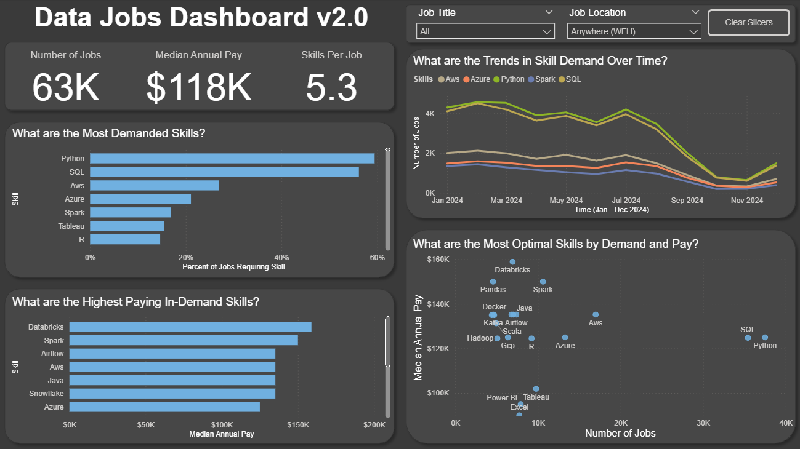

# Power BI Data Jobs Dashboard (v2.0)

## Introduction

This dashboard was created to provide specific key insights into data job postings from 2024. The dashboard displays KPIs including the number of job postings, the median annual pay, and the average number of skills required. It also presents charts that answer the following questions...

* What are the most demanded job skills?
* What are the highest paying skills that are in-demand?
* How is the demand for specific skills trending over time?
* What are the most optimal skills to have in terms of demand and pay?

Slicers are implemented to allow users to filter the data by job title (business analyst, data analyst, etc.) and by job location (i.e., Tampa, FL or WFH jobs). Using this dashboard, job seekers can gain valuable insights into lucrative skills associated with specific types of data jobs, as well as compare this information for jobs that are remote, local to Tampa, or based elsewhere.

## Skills Showcased

- **Data transformation** (ETL) with **Power Query**
- **Data modeling** by building relationships between tables (i.e., star schemas)
- Using **DAX** to perform calculations and create explicit measures
- Leveraging of core **visualizations** including bar charts, line charts, scatterplots, and KPI cards
- Implementing interactive features including **slicers** for dynamic filtering of data

## Preview of Data Jobs Dashboard (v2.0)

