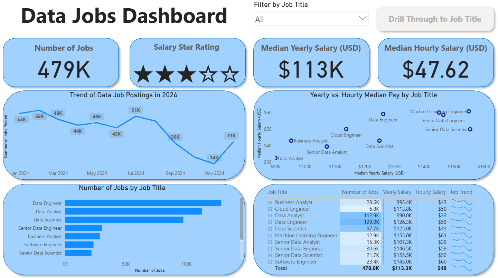
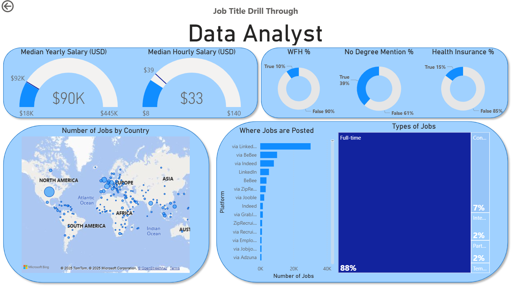

# Power BI Data Jobs Dashboard

## Introduction

This dashboard was created to provide in-depth insights into data job postings. The dashboard breaks down data from a 2024 database of job postings for data analytics and related roles (e.g., business analysts, data engineers, and data scientists). Using this dashboard, job seekers can easily gain insights into trends in the job market, such as the number of jobs available, job location, and compensation levels for various data roles.

## Skills Showcased

- **Data transformation** (ETL) with **Power Query**
- **Formulation and calculation** of key metrics about the data analysis roles (e.g., number of jobs and median salaries)
- Creation of core **visualizations** including column charts, bar charts, line charts, pie/donut charts, and map charts
- Leveraging **cards, tables, and matricies** to present key metrics in the data
-   Customizable and interactive reports using Power BI features such as:
    - **Slicers** for dynamic filtering of data (e.g., by job title)
    - **Buttons and bookmarks** for nagivating the dashboard
    - **Drill through** functionality for getting into in-depth insights for specific roles

## Preview of Data Jobs Dashboard and Drill Through

